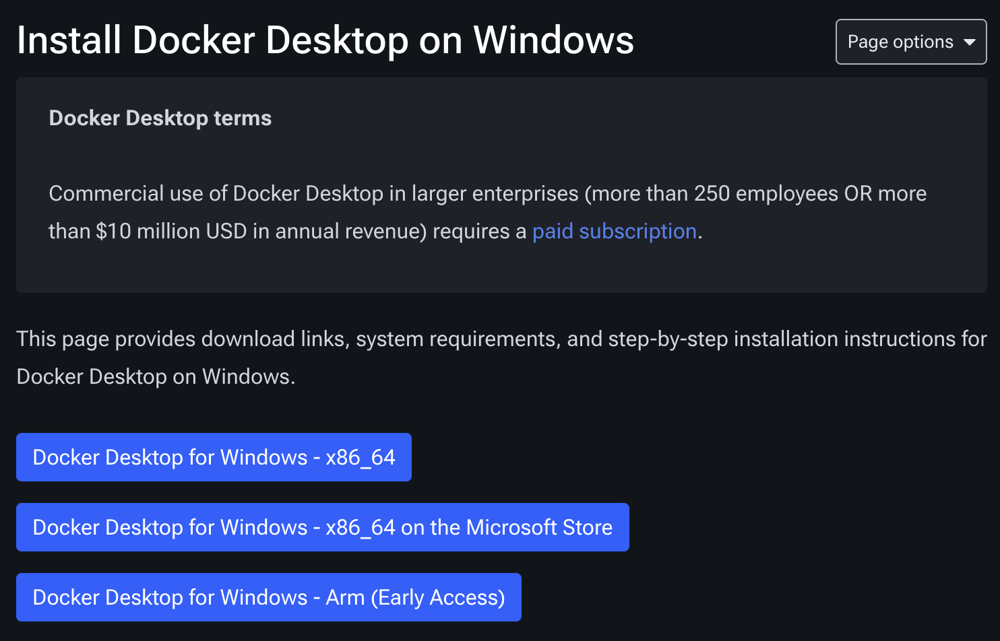
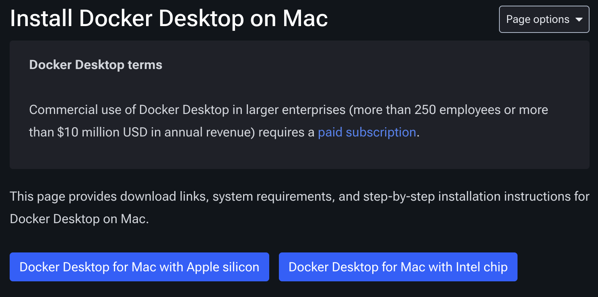

# Setup
This doc will guide you through the process of getting started with GridSecSim. The setup is meant to be minimal and clear to follow, so you can get started on OT security as quickly as possible.
#### Table of Contents
- [Windows Docker](#envwindock)
- [Windows Git](#envwingit)
- [Mac Docker](#envmacdock)
- [Mac Git](#envmacgit)

## Windows
<a id="envwindock"></a>
### Docker
1. Go to Docker Desktop install docs and pick the architecture you are on [Link](https://docs.docker.com/desktop/setup/install/windows-install/)



2. While that is installing, check if you have WSL installed by running wsl --version in CMD or PowerShell. You need `wsl` version 2.1.5 or higher. Skip to step 5 if you have the right version

```powershell
wsl --version
```

3. Open PowerShell or CMD in admin mode by typing into the Windows search bar for either, then selecting the option that shows up to run as administrator.
4. Now that you have admin PowerShell or CMD, run the appropriate command

```powershell
wsl --install
# or
wsl --update
```

> **NOTE**: If you are having trouble installing WSL, here is a link to Microsoft's docs. [Link](https://learn.microsoft.com/en-us/windows/wsl/install)

5. Now that you have `wsl` installed, it is time to run the `Docker Desktop Installer.exe` that by default is installed at `C:\Program Files\Docker\Docker`.
6. Make sure you select `wsl` instead of Hyper-V (unless you are using Hyper-V)
7. Follow the installation wizard
8. Once it is complete, if your user isn't an admin, then you need to add your user to the `docker-users` group

```powershell
net localgroup docker-users <user> /add
```

<a id="envwingit"></a>
### git
If you don't already have git installed, go here [Link](https://git-scm.com/install/windows)

## Mac
<a id="envmacdock"></a>
### Docker
1. Go to Docker Desktop install docs and pick the type of chip you have [Link](https://docs.docker.com/desktop/setup/install/mac-install/)




2. Once downloaded, double-click on the dmg file to finish the installation.

<a id="envmacgit"></a>
### git
If you don't have `git` installed use homebrew to install

```sh
brew install git
```
# Our Tooling
To make the development process easier there are several scripts that we have created in order to make the development process faster. 

## tools.sh
`tools.sh` is built to provide several benefits to the standard Docker commands. If you didn't set up the bash config with `tools.sh` then all that needs to be done is `source tools.sh` in every shell you enter.

### What it does
`tools.sh`, when sourced, finds the Docker Compose files in the current and subdirectories to build a list of services. Then, using the command `start`, you can build and start whatever containers you want with tab autocomplete on their name.

### Example use
```sh
source tools.sh
start -u <service> <service> <service>

stop -d <service>
start -u <service>

stop -s <service> <service> <service>
```

## Controller Container
This is a container within the network Docker Compose that allows us to use custom routers. 

### What it does
It will listen on the Docker socket for any container start events. When it hears them, it will exec into the container and attempt to change the default route to what we want (our routers). 

# Where to go next
Now that you have your environment setup and you know about
